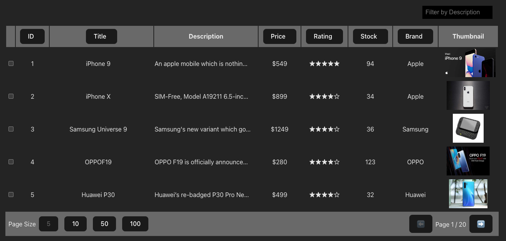
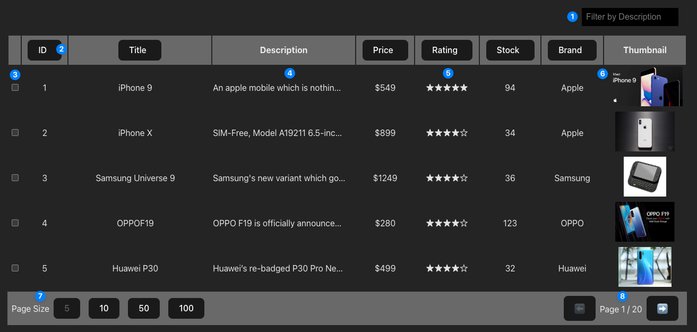

# 🧮 take-home-table



## Annotated Features



1. Filter by one field
2. Button to toggle column sort between ascending, descending and off
3. Item selection, persists across pages and sorting (but reset on filter)
4. Custom JSX cell rendering
5. "
6. "
7. Change page size
8. Pagination controls

## Installation


```bash
git clone https://github.com/bargar/take-home-table.git
cd take-home-table
yarn
yarn dev
```

Point your browser at http://localhost:5173 or the alternative port Vite tells you it's running on. 

# Stack

## React + TypeScript + Vite

This template provides a minimal setup to get React working in Vite with HMR and some ESLint rules.

Currently, two official plugins are available:

- [@vitejs/plugin-react](https://github.com/vitejs/vite-plugin-react/blob/main/packages/plugin-react/README.md) uses [Babel](https://babeljs.io/) for Fast Refresh
- [@vitejs/plugin-react-swc](https://github.com/vitejs/vite-plugin-react-swc) uses [SWC](https://swc.rs/) for Fast Refresh

### Expanding the ESLint configuration

If you are developing a production application, we recommend updating the configuration to enable type aware lint rules:

- Configure the top-level `parserOptions` property like this:

```js
   parserOptions: {
    ecmaVersion: 'latest',
    sourceType: 'module',
    project: ['./tsconfig.json', './tsconfig.node.json'],
    tsconfigRootDir: __dirname,
   },
```

- Replace `plugin:@typescript-eslint/recommended` to `plugin:@typescript-eslint/recommended-type-checked` or `plugin:@typescript-eslint/strict-type-checked`
- Optionally add `plugin:@typescript-eslint/stylistic-type-checked`
- Install [eslint-plugin-react](https://github.com/jsx-eslint/eslint-plugin-react) and add `plugin:react/recommended` & `plugin:react/jsx-runtime` to the `extends` list
